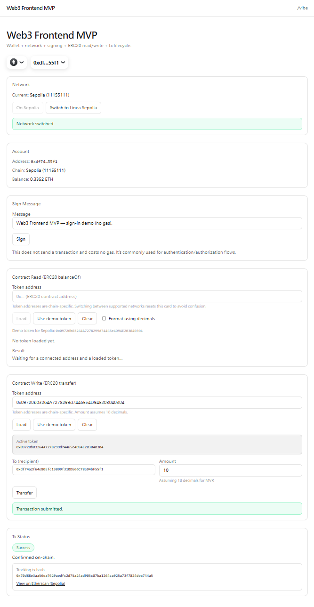
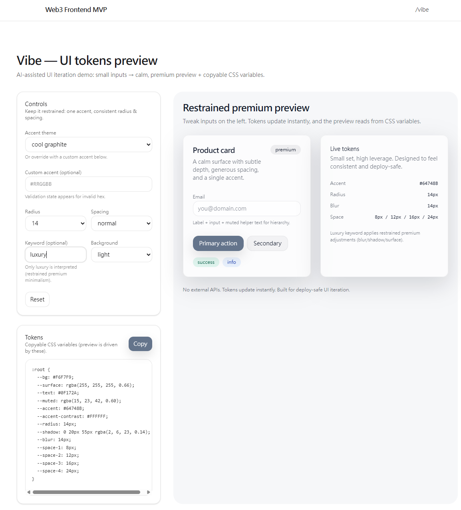

[English](./README.md) | [繁體中文](./README.zh-TW.md)

# Web3 Frontend MVP + /vibe

Two resume-ready mini projects in one repo:

- **Main: Web3 Frontend MVP** (wallet connect, network switching, signing, contract read/write, tx lifecycle + explorer links)
- **Side: /vibe** (frontend-only AI-assisted UI iteration tool: small inputs → premium/calm UI preview + tokens)

---

## Screenshots

> Placeholder images are included to keep the README complete. Replace them anytime with real screenshots at the same paths.

- Home (Web3 MVP)  
  

- /vibe  
  

---

## What it is

### Web3 Frontend MVP (Home)
A demoable, verifiable Web3 frontend covering common wallet flows and contract interactions:

- Connect wallet (RainbowKit)
- Show address / chain / native balance
- Supported network switch: Sepolia ↔ Linea Sepolia
- Wrong network state + gating (Web3Guard)
- Sign message (`useSignMessage`)
- ERC20 read: `balanceOf` (optionally read `decimals()` for formatting)
- ERC20 write: `transfer` (this MVP assumes 18 decimals and shows it in UI)
- Tx lifecycle: pending/success/error + chain-aware explorer links  
  - Detects MetaMask **Speed Up / Cancel** as replacement transactions and continues tracking the **latest hash** (no stale explorer links)

### /vibe (AI-assisted UI mini tool)
A deploy-safe, frontend-only UI iteration sandbox:

- Inputs: accent theme / radius / spacing density / keyword (luxury) / light|dark
- Preview: Card + Buttons + Input + Badge + Empty state + Validation state
- Output: real-time CSS variables tokens (the preview is actually driven by these tokens)
- Copy tokens (clipboard) + success message (fallback message if clipboard is unavailable)
- No external APIs

## Development approach (AI-assisted)

This repo was built in small, demoable commits (each commit runs and adds one capability).
- DEVLOG: `DEVLOG.md` (risks, verification, rollback notes)
- Prompts (per commit): `PROMPTS.md`
- Vibe coding process: `VIBE_CODING_PROCESS.md`

---

## Features (scannable)

### Wallet & Network
- RainbowKit connect wallet
- Account info: shortened address, chain name + chainId, native balance
- Post-connection network handling:
  - Supports Sepolia / Linea Sepolia
  - If user switches to an unsupported chain in the wallet → show **Wrong network** + gate Web3 actions

### Signing
- Sign message: input → wallet prompt → show signature
- Friendly reject errors (not just console logs)

### Contracts
- ERC20 Read: `balanceOf` (token address input + demo token)
  - Raw display (uint256 / BigInt)
  - Optional: read `decimals()` and format
  - Resets card state on supported-chain switch (avoid chain-specific token confusion)
- ERC20 Write: `transfer(to, amount)`
  - Basic validation: `to` must be an address, `amount > 0`
  - Show tx hash after submission
  - Amount assumes 18 decimals (explicit in UI)

### Tx Lifecycle + Explorer
- pending → success/error (receipt confirmation)
- chain-aware explorer links:
  - Sepolia → Etherscan
  - Linea Sepolia → LineaScan + Linea Explorer (multiple explorers to reduce indexing lag impact)
- MetaMask replacement transactions (speed up / cancel):
  - Detects replacement and tracks the latest hash
  - Shows replaced/repriced/cancelled reason when available

---

## Tech Stack
- Next.js (App Router) + TypeScript
- Tailwind CSS (v4)
- wagmi + viem
- RainbowKit
- TanStack Query (React Query)

---

## Setup

### Prerequisites
- Node.js (recommended >= 18)
- pnpm

### Install
```bash
pnpm install
```

### Env
This project uses `NEXT_PUBLIC_WALLETCONNECT_PROJECT_ID` (recommended in `.env.local`, not committed).

1) Create `.env.local`
```bash
NEXT_PUBLIC_WALLETCONNECT_PROJECT_ID=YOUR_PROJECT_ID
```

2) `.env.example` is provided as a reference.

> Without a project id:
> - Injected wallets (e.g., MetaMask) should still work
> - WalletConnect-related flows may be limited

### Run
```bash
pnpm dev
```

Open:
- Home: `http://localhost:3000`
- Vibe: `http://localhost:3000/vibe`

### Build / Start
```bash
pnpm build
pnpm start
```

---

## Quick Verification Checklist

### Home (Web3 MVP)
- Connect wallet successfully
- AccountCard shows:
  - shortened address
  - chain name + chainId
  - native balance
- NetworkCard:
  - switching between Sepolia / Linea Sepolia works
  - switching to an unsupported chain → Wrong network + Web3 section is gated
- SignMessageCard:
  - signing shows signature
  - reject shows friendly error
- ContractReadCard:
  - token address input or “Use demo token” → shows `balanceOf`
  - formatting mode (if enabled) reads decimals and displays formatted balance
- ContractWriteCard + TxStatus:
  - transfer submission shows pending immediately
  - success shows explorer links after confirmation
  - reject shows friendly error (no hash)
  - MetaMask Speed Up / Cancel updates tracking to the replacement hash (no stale pending)

### /vibe
- Changing inputs updates the preview immediately
- Empty state / validation state works
- Tokens can be copied (or fallback message shows)
- Preview is driven by tokens (bg/surface/shadow/blur/space/radius reflect changes)

---

## Notes / Limitations
- ERC20 transfer amount: currently assumes 18 decimals (MVP tradeoff; can be improved by reading decimals)
- Demo token is for testing only; token addresses are chain-specific (different per chain)
- Frontend-only demo (no backend, no external APIs)

---